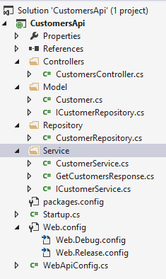
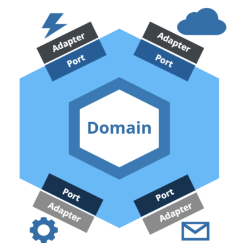

Implementación
##############

.. image:: media/clean-graph.jpg
   :height: 400px

!Arquitectura que Grita!
************************

El propósito de nuestras aplicaciones debe hacerse notar de primera mano.

La Regla de las Dependencias
****************************

Las dependencias de una aplicación deben dirigirse en la vía de mayor
abstracción.

.. graphviz:: media/three-layers.dot

Capas y Fronteras
*****************

Los componentes de una aplicación se comunican entre sí a través de fronteras
bien definidas.

Los Detalles
************

Las consideraciones de infraestructura son sólo *detalles* del sistema.
La base de datos, el framework web, las librerías de consola, son sólo
herramientas de nuestras aplicaciones y no su esencia.

    *"For the framework author, coupling to his or her own framework
    is not a risk..."*

    *"The author wants you to couple to the framework, because once
    coupled in this way, it is very hard to break away."*

    *Uncle Bob*

El Componente Principal
***********************

El más sucio de los componentes. Es el encargado de instanciar el arbol de
dependencias para crear la aplicación final.

.. graphviz:: media/main.dot

Las Pruebas
***********

Las pruebas o *tests* son el componente más externo de nuestra aplicación. A
pesar de que no pueden asegurar que nuestras aplicaciones son correctas, si
pueden informarnos que *no son incorrectas* y prevenir regresiones durante el
desarrollo.

